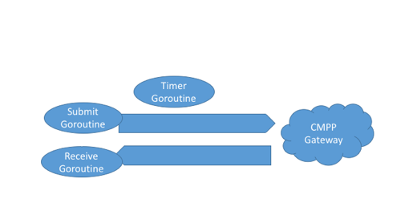

HTTP网关---CMPP3.0
-------

## 目标
将复杂的cmpp3.0的协议转成http的发送接口，给web程序提供一个易用的短信发送、接收接口
##安装配置

### 依赖说明
- 服务依赖
Redis -- 作为发送记录存储
CMPP网关 -- 移动提供
确保以上服务已经启动之后再启动本服务。
- 代码依赖
github.com/bigwhite/gocmpp
github.com/garyburd/redigo/redis
已经在vendor目录下，不需要额外的go get
### 安装redis
下载redis最新版本，即可

> 建议使用3.0版本

linux版本安装，请参考[官网](http://redis.io/)
windows参考 [windows的Redis版本](https://github.com/MSOpenTech/redis/releases)，建议安装成windows的服务， 参考 [这里](https://raw.githubusercontent.com/MSOpenTech/redis/3.0/Windows%20Service%20Documentation.md)

for instance
redis-server --service-install redis.windows.conf --loglevel verbose
### 安装程序
直接拷贝即可，安装文件见这里（cmpp目录）
链接: [http://pan.baidu.com/s/1skNVkNr](http://pan.baidu.com/s/1skNVkNr) 密码: yafb

### 配置文件说明
配置文件config.json

	{
	  "user": "204221",     //用于登陆网关的帐户名称
	  "password": "052932",    //登陆网关密码
	  "sms_accessno": "1064899104221",    //接入码  会作为发送方显示在终端上
	  "service_id": "JSASXW",     //网关分配的业务标识
	  "http_host": "0.0.0.0",       //http服务绑定的ip，0.0.0.0指的是绑定本机所有的网卡ip
	  "http_port": "8000",         //http服务绑定的端口
	  "cmpp_host": "127.0.0.1",    //cmpp网关的ip
	  "cmpp_port": "7891",          //cmpp网关的端口
	  "debug": true,                    //debug为true，会打印一些调试信息
	  "redis_host": "127.0.0.1",   //redis的ip
	  "redis_port": "6379",          //redis的端口
	  "redis_password": ""          //redis的密码，如果没有设置密码则留空
	}

### 启动

- Linux
  sh ./cmpp-gateway

- Windows
  双击执行cmpp-gateway.exe


## For Developer
### 安装CMPP3.0网关模拟器

**注意**：原 README 中提到的外部 CMPP 模拟器下载链接已失效。现在推荐使用本项目自带的模拟器。

#### 使用本项目自带的模拟器（推荐）

本项目在 `simulator/` 目录下提供了一个简单但完整的 CMPP 3.0 模拟器，无需 JVM，直接使用 Go 编译运行：

```bash
# 编译模拟器
cd simulator
go build -mod=vendor -o cmpp-simulator server.go

# 运行模拟器
./cmpp-simulator
```

详细使用说明请查看：[simulator/README.md](simulator/README.md)

模拟器功能：
- ✅ 支持 CMPP 3.0 和 CMPP 2.0 协议
- ✅ 自动接受所有连接（无需配置用户名密码）
- ✅ 处理短信提交，返回成功响应
- ✅ 支持心跳检测
- ✅ 详细的日志输出

#### 其他模拟器方案

如果你需要更完整的商业级模拟器，可以搜索"CMPP 模拟器"或"CMPP Simulator"，部分商业模拟器提供试用版本。

> 注：
>  模拟器仅用于开发测试，不会真实发送短信
>  正式使用请直接连接移动运营商提供的 CMPP 网关

### 编译代码
git clone https://github.com/JoeCao/cmpp-gateway.git
设置GOPATH环境变量
生成linux 64bit

    GOOS=linux GOARCH=amd64 go build

生成windows 64bit

    GOOS=windows GOARCH=amd64 go build


### 流程说明
CMPP的规范中，希望使用TCP全双工的能力，通过异步的方式交换数据。
从实际的场景，移动对CMPP的连接数也是有限制的。
所以本着尽量复用链接的目标，我们设计了三个goroutine，在一个链接上分别异步工作。如下图（图很丑，见谅）
    

Submit/Submit Resp 为异步传输，发送时填写了序列号"SEQID"，但是"MSGID"这个重要标识字段需要网关生成并返回。
而在异步Resp消息体中，规范中要求“SP根据请求和应答消息的Sequence_Id一致性就可得到CMPP_Submit消息的Msg_Id”
这说明要在提交(submit)短信，和短信提交结果（submitresponse）之间需要关联一个ID。CMPP协议中，规定了SEQID作为来回应答的标识。
所以在submit后，我们将SEQID保存到KV存储中，然后在返回的消息中通过SEQID查找对应的消息。

同理Submit Response和Delivery Report之间通过MSGID关联，也需要保存对应的KV。不过本次因为对Delivery Report没有特殊保存要求，所以就不实现了。

## 感谢
感谢 @bigwhite 提供了坚实可靠的CMPP协议基础
https://github.com/bigwhite/gocmpp.git
